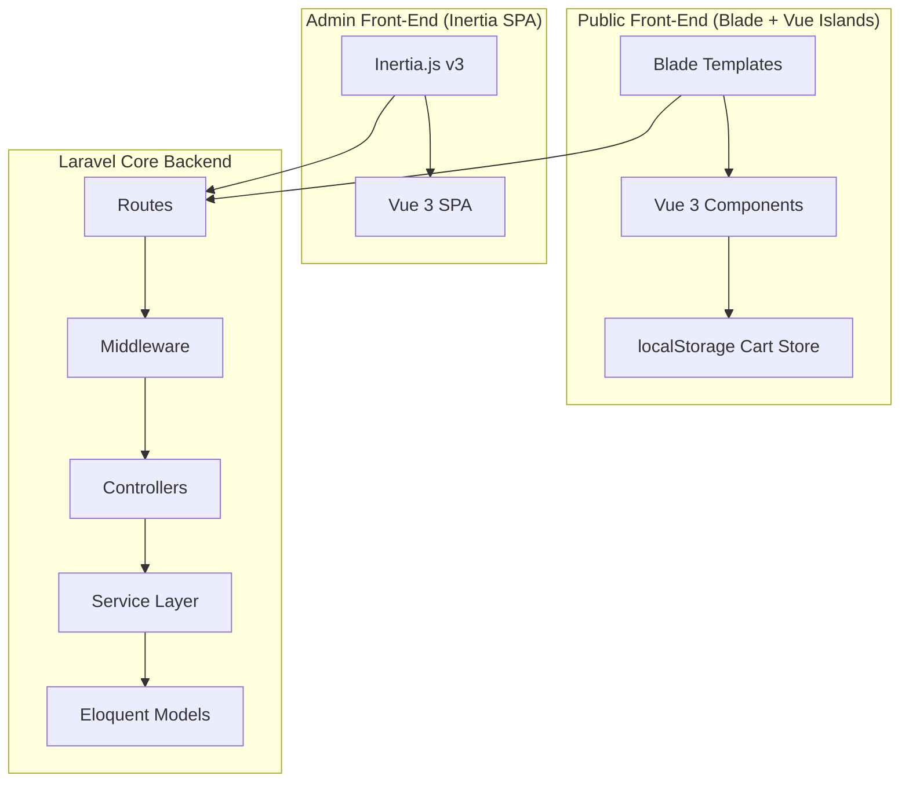

<h1 align="center">ShopNow</h1>

<p align="center">
  <strong>A Premium, Modular E-Commerce Platform & CMS</strong>
</p>

<p align="center">
  
  
  
  
  
  
</p>

---

## 🌟 Overview

**ShopNow** is a premium, full-featured modular e-commerce platform and Content Management System (CMS) designed for modern retail. Built on a robust **Laravel 13** backend and a reactive **Vue 3** frontend, it features a **dual-frontend architecture**: a highly interactive Single Page Application (SPA) admin dashboard powered by **Inertia.js v3**, paired with a lightning-fast, SEO-optimized public storefront powered by server-rendered **Blade templates** and reactive **Vue 3 Islands**.

---

## 🏗️ Architectural Blueprint

The application is built around a **Modular MVC** pattern with a lightweight **Service Layer** to isolate business operations into testable, reusable units.

### Modular Boundaries
Instead of cluttering the default `app/` directory, all core domains are encapsulated inside self-contained modules under the `modules/` folder. Each module encapsulates its own routes, models, controllers, services, form requests, views, migrations, seeders, and Pest feature tests.



---

## ⚡ Key Features

- **Modular Domain Design** — Feature modules for Acl, Product, Cart, Order, Blog, Settings, Profile, Slider, and more.
- **Dual-Frontend Strategy** — A fully-interactive admin panel using Inertia + Vue SPA, alongside an SEO-friendly public storefront using Blade and Vue 3 islands.
- **Spatie Integration** — Advanced media uploads and conversions via Spatie Media Library, granular roles/permissions via Spatie Permission, and automated audit trails via Spatie Activitylog.
- **Granular ACL System** — Permission-gated routes and UI actions with support for direct user permissions and role-based policies.
- **Meta Conversions API** — Built-in server-side Facebook Pixel and Conversions API integration to track user signups, leads, pageviews, and purchases with SHA-256 hashed PII data.
- **Robust Geocoding & Addresses** — Integrated with Bangladesh geocoding (Division, District, Upazila, Union) supporting saved customer addresses and default selectors, with division auto-derivation on district changes.
- **SEO & Caching Ready** — Dynamic schema generator (`JSON-LD`), auto-meta tags for posts/products, automated XML sitemaps, and database settings cached for 24 hours.

---

## 🛠️ Technology Stack

| Layer | Technologies |
|---|---|
| **Runtime** | PHP 8.4.23+, Node.js 20+ |
| **Framework** | Laravel 13.16.1 |
| **Admin Frontend** | Vue 3.4.21, Inertia.js v3 (client v2.3), Pinia, Flowbite, Remix Icon |
| **Public Storefront** | Laravel Blade, Vue 3 Islands, Tailwind CSS v4.2.4 |
| **Database** | SQLite (default dev), MySQL / MariaDB (production-ready) |
| **Testing** | Pest v4.0 (feature & unit suites) |
| **Code Style** | Laravel Pint (PSR-12), ESLint v9, Prettier v3 |

---

## 📂 Repository Directory Layout

```
shopnow/
├── app/                        # Application bootstrap & shared middleware
├── bootstrap/                  # Route & middleware configuration (app.php)
├── config/                     # Application & package settings
├── database/                   # Seeders & global migrations
├── modules/                    # Self-contained domain modules
│   ├── Acl/                    # Roles & permissions management
│   ├── AdminAuth/              # Admin login & password reset
│   ├── Blog/                   # Blog posts, categories, tags, and authors
│   ├── Cart/                   # Client-side shopping cart endpoints
│   ├── ContactMessage/         # Contact forms & submissions
│   ├── Customer/               # Customer CRUD, addresses, & report generator
│   ├── CustomerAuth/           # Customer login, signup, & address management
│   ├── Dashboard/              # Admin analytics & KPI charts
│   ├── Index/                  # Home, sitemap, robots.txt & static page controllers
│   ├── Order/                  # Order processing, status updates & invoicing
│   ├── Page/                   # CMS system pages (About, Terms, Privacy)
│   ├── Product/                # Products, categories, brands & attribute variants
│   ├── Profile/                # Current user profile manager
│   ├── Settings/               # Site-wide settings (SMTP, SEO, Pixels, Branding)
│   ├── Slider/                 # Homepage hero banners
│   ├── Support/                # Base controllers, models, and shared traits
│   └── User/                   # Admin user manager
├── resources/                  # Admin single page application source (Inertia + Vue)
├── resources-site/             # Customer-facing storefront assets & views (Blade + CSS + Vue)
├── routes/                     # Fallback & local console routes
├── tests/                      # Global test bootstrap & TestCase
└── vite.config.js              # Vite compiler configuration
```

---

## 🚀 Getting Started

### Prerequisites
- PHP 8.4 or higher
- Composer
- Node.js 20+ & npm
- MySQL / MariaDB or SQLite database

### Installation & Setup

1. **Clone the Repository**
   ```bash
   git clone https://github.com/your-username/shopnow.git
   cd shopnow
   ```

2. **Install Composer & NPM Dependencies**
   ```bash
   composer install
   npm ci
   ```

3. **Configure Environment**
   ```bash
   cp .env.example .env
   php artisan key:generate
   ```
   *Edit `.env` and specify your database credentials (`DB_DATABASE`, `DB_USERNAME`, etc.).*

4. **Run Migrations & Database Seeding**
   ```bash
   php artisan migrate --seed
   ```

5. **Build Assets & Launch Development Server**
   ```bash
   # Compiles and serves assets via Vite + runs artisan dev servers concurrently
   composer run dev
   ```

---

## ⏰ Cron Job Setup Guide (cPanel / Shared Hosting)

ShopNow utilizes Laravel's task scheduler and queue system to handle asynchronous tasks such as sending customer order confirmation emails, administrative notifications, processing Meta Conversions API events, and periodic background maintenance.

To ensure these tasks run automatically on cPanel or shared hosting, configure a server Cron Job to execute Laravel's `schedule:run` command every minute.

### 1. Access Cron Jobs in cPanel
1. Log in to your **cPanel Dashboard**.
2. Navigate to the **Advanced** section and click on **Cron Jobs**.

### 2. Add New Cron Job
1. Under **Common Settings**, select **Once Per Minute** (`* * * * *`).
2. In the **Command** field, enter the following command (adjust paths for your server):

```bash
/usr/local/bin/php /home/your_username/public_html/artisan schedule:run >> /dev/null 2>&1
```

> 💡 **Note**: Replace `/home/your_username/public_html` with your actual project root path where the `artisan` file is located.

### 3. PHP Binary Path Variations
Depending on your hosting provider and PHP version, use the specific PHP 8.4 binary path:

- **cPanel EasyApache (ea-php)**:
  ```bash
  /opt/cpanel/ea-php84/root/usr/bin/php /home/your_username/public_html/artisan schedule:run >> /dev/null 2>&1
  ```
- **CloudLinux PHP Selector (alt-php)**:
  ```bash
  /opt/alt/php84/usr/bin/php /home/your_username/public_html/artisan schedule:run >> /dev/null 2>&1
  ```
- **Custom/Standard Path**: Find your exact PHP path by running `which php` in the cPanel Terminal.

### 4. Optional Queue Worker Cron (for Database Queue Driver)
If your `.env` has `QUEUE_CONNECTION=database` and you want background jobs (like emails) to process automatically on shared hosting without a persistent daemon, add a second cron job running every minute:

```bash
/usr/local/bin/php /home/your_username/public_html/artisan queue:work --stop-when-empty >> /dev/null 2>&1
```

---

## 🧪 Testing & Code Quality

ShopNow enforces high coding standards with integrated linting and automated tests:

```bash
# Run all Pest feature and unit tests
php artisan test --compact

# Auto-format PHP code according to PSR-12 conventions
vendor/bin/pint

# Run frontend ESLint and Prettier formatting checks
npm run lint
```

---

## 📄 License

ShopNow is open-source software licensed under the [MIT license](LICENSE).
