# ShopNow — Architectural Audit Report

> **Generated:** 2026-07-17  
> **Auditor:** MiMoCode Staff Software Architect  
> **Scope:** Complete codebase — backend, frontend, database, infrastructure

---

## Table of Contents

- [1. Project Overview](#1-project-overview)
- [2. Folder Structure](#2-folder-structure)
- [3. Application Architecture](#3-application-architecture)
- [4. Request Lifecycle](#4-request-lifecycle)
- [5. Route Analysis](#5-route-analysis)
- [6. Middleware Analysis](#6-middleware-analysis)
- [7. Authentication & Authorization](#7-authentication--authorization)
- [8. Module Architecture](#8-module-architecture)
- [9. Database Architecture](#9-database-architecture)
- [10. Eloquent Models](#10-eloquent-models)
- [11. Business Logic Layer](#11-business-logic-layer)
- [12. Controllers](#12-controllers)
- [13. Validation](#13-validation)
- [14. Vue Frontend Architecture (Admin)](#14-vue-frontend-architecture-admin)
- [15. Frontend Architecture (Public Site)](#15-frontend-architecture-public-site)
- [16. Inertia Architecture](#16-inertia-architecture)
- [17. Tailwind Architecture](#17-tailwind-architecture)
- [18. State Management](#18-state-management)
- [19. Events & Queues](#19-events--queues)
- [20. Storage](#20-storage)
- [21. Security Audit](#21-security-audit)
- [22. Performance Audit](#22-performance-audit)
- [23. Code Quality Audit](#23-code-quality-audit)
- [24. Dependency Analysis](#24-dependency-analysis)
- [25. Configuration Analysis](#25-configuration-analysis)
- [26. Testing Architecture](#26-testing-architecture)
- [27. Deployment Architecture](#27-deployment-architecture)
- [28. Coding Standards](#28-coding-standards)
- [29. Strengths](#29-strengths)
- [30. Weaknesses](#30-weaknesses)
- [31. Improvement Roadmap](#31-improvement-roadmap)
- [32. Architecture Scorecard](#32-architecture-scorecard)

---

## 1. Project Overview

### Application Purpose

**ShopNow** is a full-featured e-commerce platform with an admin CMS, supporting product management, order processing, blog, customer management, contact messages, and SEO-optimized public storefront. It serves two distinct user types: **admin users** (back-office staff) and **customers** (storefront shoppers).

### Technology Stack

| Layer | Technology | Version |
|---|---|---|
| **Runtime** | PHP | 8.4.23 |
| **Framework** | Laravel | 13.16.1 |
| **Frontend (Admin)** | Vue 3 + Inertia.js | Vue 3.4.21 / Inertia v3 (client: v2.3) |
| **Frontend (Site)** | Blade + Vue 3 Islands | Same Vue/Pinia stack |
| **CSS** | Tailwind CSS | v4.2.4 |
| **Build Tool** | Vite | v8.0.14 |
| **Database** | SQLite (default) / MySQL | — |
| **Queue** | Database driver | — |
| **Testing** | Pest | v4.0 |

### Key Composer Packages

| Package | Version | Purpose |
|---|---|---|
| `daniel-cintra/modular` | ^0.5.0 | Modular architecture for Laravel |
| `inertiajs/inertia-laravel` | ^3.0 | Inertia server-side adapter |
| `spatie/laravel-medialibrary` | ^11.22 | File/media management |
| `laravel/boost` | ^2.4 | Dev tooling (MCP server) |
| `laravel/pint` | ^1.13 | Code formatting |
| `pestphp/pest` | ^4.0 | Testing framework |

### Key NPM Packages

| Package | Version | Purpose |
|---|---|---|
| `@inertiajs/vue3` | ^2.3 | Inertia client adapter |
| `pinia` | ^2.2.5 | Vue state management |
| `chart.js` | ^4.4.4 | Dashboard charts |
| `vuedraggable` | ^4.1.0 | Drag-and-drop reordering |
| `@tiptap/vue-3` + extensions | ^2.2.4 | Rich text editor |
| `flowbite` | ^2.5.2 | UI component library |
| `remixicon` | ^4.2.0 | Icon set |
| `unplugin-vue-components` | ^0.27.1 | Auto component registration |

---

## 2. Folder Structure

```
shopnow/
├── app/                        # Core Laravel application code
│   ├── Http/
│   │   ├── Controllers/        # (empty — controllers live in modules)
│   │   └── Middleware/
│   │       └── HandleInertiaRequests.php  # Inertia shared props
│   ├── Jobs/
│   │   └── SendOrderPlacedMail.php        # Queued email job
│   ├── Mail/
│   │   └── OrderPlacedMail.php            # Order notification mailable
│   ├── Models/                 # (minimal — Product.php is unused stub, User.php is default scaffold)
│   │   ├── Product.php         # Stub model (unused)
│   │   └── User.php            # Default scaffold (unused by auth)
│   └── Providers/
│       └── AppServiceProvider.php          # Mail config + SEO view composer
├── bootstrap/
│   ├── app.php                 # Route, middleware, exception config
│   ├── providers.php           # All 18 service providers registered
│   └── cache/                  # Compiled caches
├── config/                     # Laravel + package configuration
│   ├── activitylog.php         # Spatie activity log config
│   ├── app.php                 # App name, timezone, env
│   ├── auth.php                # Dual guard: user + customer
│   ├── cache.php               # Cache stores
│   ├── database.php            # SQLite default, MySQL optional
│   ├── filesystems.php         # local / public / s3 disks
│   ├── inertia.php             # Inertia SSR config
│   ├── logging.php             # Log channels
│   ├── mail.php                # Mail transports
│   ├── modular.php             # Login URL + default routes
│   ├── permission.php          # Spatie Permission config
│   ├── queue.php               # Database queue driver
│   ├── services.php            # Third-party service keys
│   ├── session.php             # Database sessions
│   └── view.php                # View paths
├── database/
│   ├── factories/              # UserFactory (default)
│   ├── migrations/             # 11 migrations (core + module-loaded)
│   └── seeders/                # DatabaseSeeder
├── modules/                    # ** Modular domain code **
│   ├── Acl/                    # Roles & permissions management
│   ├── AdminAuth/              # Admin login/logout/password reset
│   ├── Blog/                   # Blog posts, categories, tags, authors
│   ├── Cart/                   # Shopping cart (backend scaffold)
│   ├── ContactMessage/         # Contact form submissions
│   ├── Customer/               # Customer CRUD + reports
│   ├── CustomerAuth/           # Customer login/signup/password reset
│   ├── Dashboard/              # Admin dashboard with KPIs
│   ├── Index/                  # Homepage, sitemap, robots.txt, static pages
│   ├── Order/                  # Order CRUD, reports, site ordering
│   ├── Page/                   # CMS pages (about, privacy, etc.)
│   ├── Product/                # Products, categories, brands, tags
│   ├── Profile/                # User profile management
│   ├── Settings/               # App settings, SEO service, Meta API
│   ├── Slider/                 # Homepage slider management
│   ├── Support/                # Base classes, traits, validators, helpers
│   └── User/                   # Admin user management
├── resources/
│   ├── css/app.css             # Tailwind v4 entry + CSS custom properties
│   ├── images/                 # Static images
│   ├── js/                     # ** Inertia admin SPA **
│   │   ├── app.js              # Inertia + Vue + Pinia bootstrap
│   │   ├── Components/         # 40+ shared Vue components
│   │   ├── Composables/        # 8 Vue composables
│   │   ├── Configs/menu.js     # Sidebar navigation config
│   │   ├── Layouts/            # AuthenticatedLayout, GuestLayout
│   │   ├── Pages/              # 24 page directories (Inertia pages)
│   │   ├── Plugins/            # Translations plugin
│   │   ├── Resolvers/          # Auto component resolver
│   │   └── Utils/              # Utility functions
│   └── views/                  # app.blade.php (Inertia root)
├── resources-site/             # ** Public storefront **
│   ├── css/                    # site.css
│   ├── images/                 # Site images
│   ├── js/
│   │   ├── create-vue-app.js   # Shared Vue app factory
│   │   ├── index-app.js        # Homepage Vue islands
│   │   ├── blog-app.js         # Blog Vue islands
│   │   ├── Components/         # 9 site Vue components
│   │   └── Stores/CartStore.js # Client-side cart (localStorage)
│   └── views/
│       ├── site-layout.blade.php       # Public site layout (SEO, pixels)
│       ├── components/                 # Blade components (header, footer, etc.)
│       └── pagination/                 # Custom pagination views
├── routes/
│   ├── web.php                 # Minimal (geo lookup endpoints)
│   └── console.php             # Console routes
├── storage/                    # App storage, sessions, views cache
├── tests/
│   ├── Feature/                # 2 example tests
│   ├── Unit/                   # 1 example test
│   ├── Pest.php                # Pest configuration
│   └── TestCase.php            # Base test case
├── deploy.sh                   # Deployment script
├── vite.config.js              # Vite build config
├── tailwind.config.cjs         # Tailwind theme + design tokens
├── eslint.config.js            # ESLint config
├── postcss.config.js           # PostCSS config
└── phpunit.xml                 # PHPUnit config
```

### Key Conventions

- **Modules are self-contained**: Each module owns its own Models, Controllers, Services, Requests, Routes, Migrations, Seeders, Tests, and Views.
- **Dual frontend**: The admin panel uses Inertia.js + Vue SPA; the public site uses Blade templates with Vue 3 component islands.
- **Base classes in Support**: All modules extend from shared base controllers, models, and traits in the `Support` module.
- **Module naming**: PascalCase directory names matching the domain concept (e.g., `Product`, `Blog`, `Order`).

---

## 3. Application Architecture

### Architectural Style: **Modular MVC with Service Layer**

The application follows a **Modular MVC** pattern built on `daniel-cintra/modular`. Within each module, the architecture extends into a lightweight **Service Layer** pattern where business logic is extracted into dedicated Service classes.

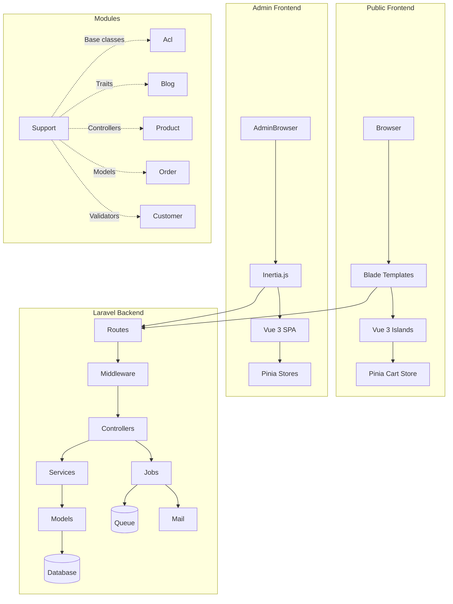

### Why This Architecture Works

The modular approach provides clear domain boundaries while the `Support` module serves as a shared foundation. The dual frontend strategy (Inertia SPA for admin, Blade + Vue islands for public) allows the admin panel to have full SPA interactivity while keeping the public site SEO-friendly with server-rendered HTML.

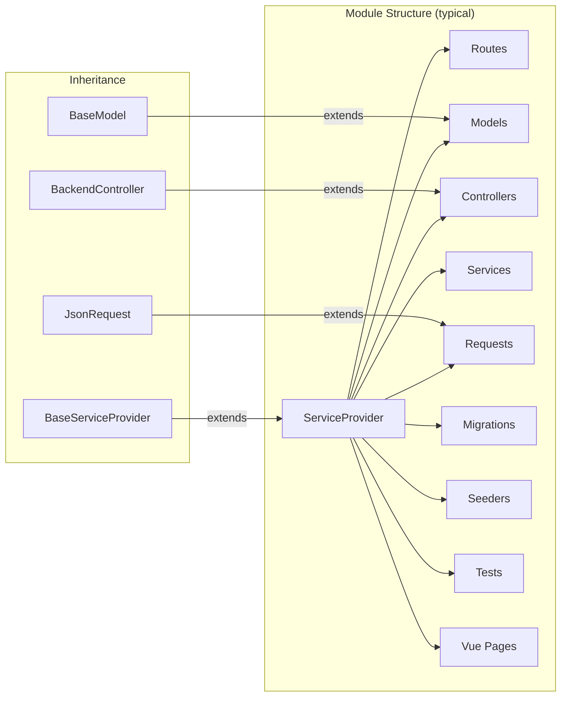

---

## 4. Request Lifecycle

### Admin Panel (Inertia SPA)

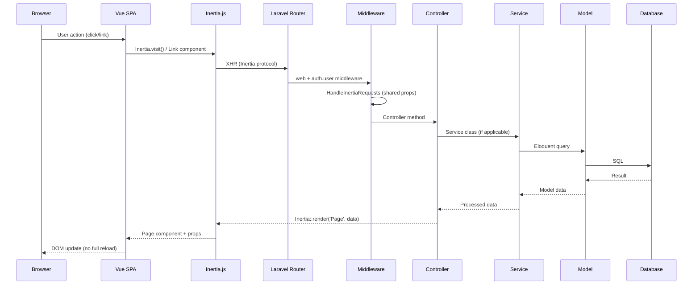

### Public Site (Blade + Vue Islands)

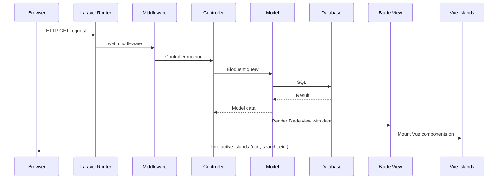

### Request Flow Layers

| Layer | Responsibility |
|---|---|
| **Browser** | Renders HTML, executes JS, sends requests |
| **Inertia.js / Blade** | SPA routing (admin) or server rendering (site) |
| **Route** | Maps URL to controller method |
| **Middleware** | Authentication, CSRF, session, Inertia shared props |
| **Controller** | Request handling, validation, response composition |
| **Service** | Business logic, data transformation, orchestration |
| **Model** | Eloquent ORM, relationships, scopes |
| **Database** | Persistent storage, queries |

---

## 5. Route Analysis

### Route Registration

Routes are NOT defined in `routes/web.php` (which only has 2 geo-lookup routes). Instead, each module registers its own routes via its `ServiceProvider` through the `BaseServiceProvider` pattern.

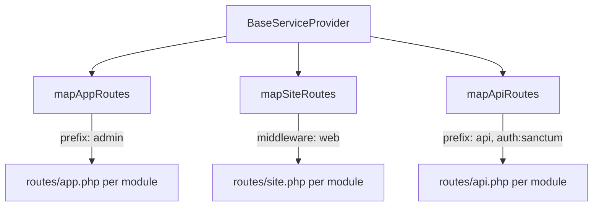

### Admin Routes (routes/app.php)

All admin routes are under `/admin` prefix with `web` + `auth.user` middleware:

| Module | Prefix | Key Routes | Permission Gates |
|---|---|---|---|
| **Dashboard** | `dashboard` | `GET /` | `Dashboard` |
| **ACL** | `acl-` | CRUD for permissions, roles, role-permissions, user-roles, user-permissions | `Acl: Permission - List`, `Acl: Role - List`, etc. |
| **User** | `user` | CRUD for admin users | None |
| **Blog** | `blog-` | CRUD for posts, categories, tags, authors | `Blog: Post - List`, `Blog: Category - List`, etc. |
| **Product** | `product-` | CRUD for products, categories, brands, tags + reports | `product-list`, `product-category-list`, etc. |
| **Customer** | `customer` | CRUD for customers + reports + recycle bin | `customer-list`, `customer-create`, etc. |
| **Order** | `order` | CRUD + status update + reports | `order-list` |
| **ContactMessage** | `contact-message` | CRUD + recycle bin | `contact-message-list` |
| **Page** | `page` | CRUD + recycle bin | `page-list`, `page-create`, etc. |
| **Slider** | `slider` | CRUD + recycle bin | `slider-list`, `slider-create`, etc. |
| **Settings** | `settings` | GET/POST by group | `settings-list`, `settings-edit` |
| **Profile** | `profile` | Show, update, password, email | None (own profile) |
| **Cart** | `cart` | CRUD (backend) | None |

### Site Routes (routes/site.php)

| Module | Route | Method | Controller |
|---|---|---|---|
| **Index** | `/` | GET | `IndexController@index` |
| **Index** | `/about`, `/privacy-policy`, `/terms-of-service`, `/refund-policy` | GET | `IndexController@*` |
| **Index** | `/sitemap.xml`, `/sitemap-*.xml` | GET | `SitemapController` |
| **Index** | `/robots.txt` | GET | `RobotsController` |
| **Blog** | `/blog`, `/blog/{slug}` | GET | `SitePostController` |
| **Blog** | `/blog/archive/{date}`, `/blog/tag/{slug}`, `/blog/search/{term}` | GET | `SiteArchiveController`, `SiteTagController`, `SitePostSearchController` |
| **Product** | `/shop/`, `/shop/product/{id}/{slug}`, `/shop/category/{id}/{slug}` | GET | `SiteProductController` |
| **Product** | `/shop/search/{text?}`, `/brand/{id}/{slug}`, `/brands` | GET | `SiteProductController` |
| **Order** | `POST /site-order-store`, `GET /order-confirm/{id}` | POST/GET | `SiteOrderController` |
| **Cart** | `/cart`, `/checkout` | GET | `SiteCartController` |
| **AdminAuth** | `/admin`, `/admin-auth/*` | GET/POST | Auth controllers |
| **CustomerAuth** | `/login`, `/signup`, `/forgot-password`, `/reset-password/*` | GET/POST | Auth controllers |
| **ContactMessage** | `GET/POST /contact` | GET/POST | `SiteContactMessageController` |

---

## 6. Middleware Analysis

### Registered Middleware

Defined in `bootstrap/app.php`:

| Alias | Class | Scope | Purpose |
|---|---|---|---|
| `auth.user` | `Modules\AdminAuth\Http\Middleware\UserAuth` | Admin routes | Checks `Auth::guard('user')->guest()`, redirects to login |
| `auth.customer` | `Modules\CustomerAuth\Http\Middleware\CustomerAuth` | Customer routes | Checks `Auth::guard('customer')->guest()`, redirects to login |
| `HandleInertiaRequests` | `App\Http\Middleware\HandleInertiaRequests` | Global web | Injects shared props (auth, permissions, ziggy, flash, branding) |

### Middleware Execution Order

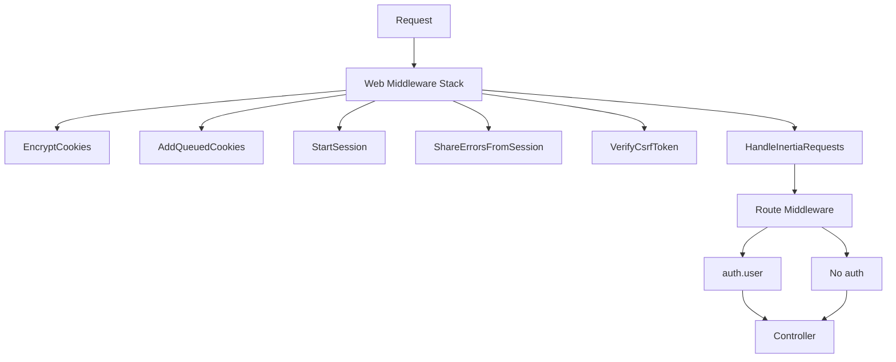

### Per-Route Middleware Application

- **All admin routes** (via `BaseServiceProvider::mapAppRoutes()`): `['web', 'auth.user']`
- **All site routes** (via `BaseServiceProvider::mapSiteRoutes()`): `['web']`
- **ACL routes**: Additional `can:` gates on each route (e.g., `can:Blog: Post - List`)
- **Some admin routes** (customer, order, etc.): Additional `can:customer`, `can:order` middleware

---

## 7. Authentication & Authorization

### Authentication Architecture

The application implements **dual authentication** — separate guards for admin users and customers:

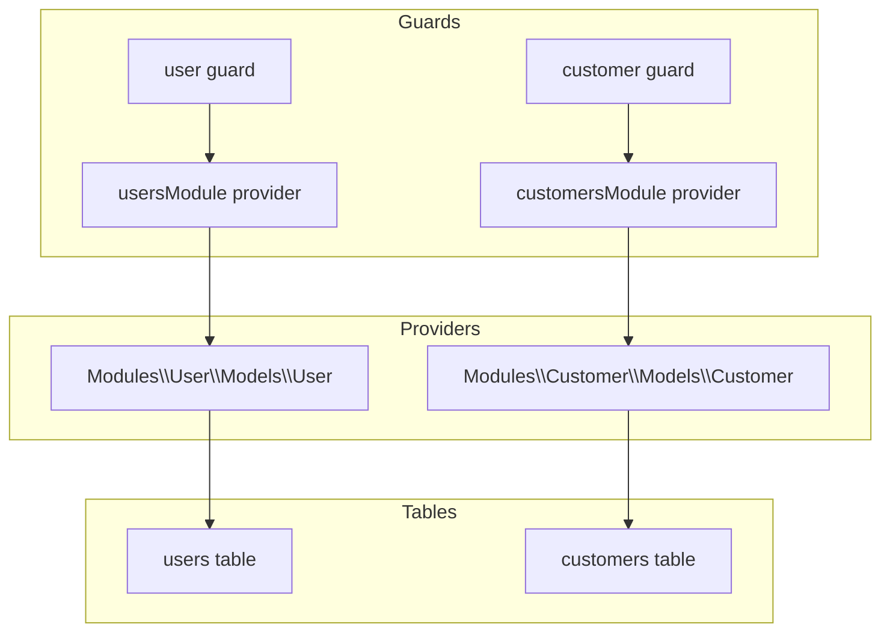

**Configuration** (`config/auth.php`):
- Default guard: `user`
- `user` guard → `usersModule` provider → `Modules\User\Models\User`
- `customer` guard → `customersModule` provider → `Modules\Customer\Models\Customer`

### Admin Login Flow

1. GET `/admin` → `AdminAuth\AuthenticatedSessionController@loginForm` (Blade)
2. POST `/admin-auth/login` → `LoginRequest::authenticate()` (rate-limited: 5 attempts)
3. `Auth::attempt(['email' => ..., 'password' => ...], false)` using `user` guard
4. On success → redirect to `dashboard.index`
5. On failure → redirect back with error

### Customer Login Flow

1. GET `/login` → `CustomerAuth\AuthenticatedSessionController@loginForm` (Blade)
2. POST `/login` → `LoginRequest::authenticate()` using `customer` guard
3. On success → redirect to `site.index`

### Customer Signup Flow

1. GET `/signup` → `CustomerAuth\AuthenticatedSessionController@signupForm` (Blade)
2. POST `/signup` → Creates `Customer` via `CustomerController::create()`, logs in via `Auth::guard('customer')->attempt()`
3. Tracks `CompleteRegistration` event via `MetaConversionApiService`

### Password Reset

Both guards have independent password reset flows using their respective brokers:
- Admin: `Password::broker('usersModule')` → `password_reset_tokens` table
- Customer: `Password::broker('customersModule')` → `password_reset_tokens` table

### Authorization: Roles & Permissions

Uses **Spatie Laravel Permission** with a two-tier model:

1. **Roles**: A single `root` role that bypasses ALL permission gates (via `Gate::before()`)
2. **Permissions**: ~100 granular permissions organized by module:
   - `{module}-menu`, `{module}-list`, `{module}-create`, `{module}-edit`, `{module}-delete`, `{module}-recycle-bin-*`
   - `Acl: Permission - {action}`, `Acl: Role - {action}`, `Acl: User: Role - Edit`
   - `Blog: {Entity} - {Action}` (e.g., `Blog: Post - List`)
   - `settings-list`, `settings-edit`, `pixel-settings-edit`

### Permission Checking

**Server-side**: Routes use Laravel's `can:` middleware (e.g., `can:Blog: Post - List`), which delegates to Spatie's registered gate callback.

**Client-side**: The `useAuthCan` composable checks `page.props.auth.permissions.includes(permission)`. Root users always return `true`.

```javascript
// resources/js/Composables/useAuthCan.js
const can = (permission) => {
    if (auth && auth.isRootUser) return true
    return auth && auth.permissions.includes(permission)
}
```

### ACL Module

The ACL module provides full CRUD for:
- **Permissions** (name-based)
- **Roles** (name-based)
- **Role ↔ Permission** assignment
- **User ↔ Role** assignment
- **User ↔ Permission** direct assignment

---

## 8. Module Architecture

The application contains **17 modules** under `modules/`. Each module is a self-contained domain unit.

### Module Dependency Diagram

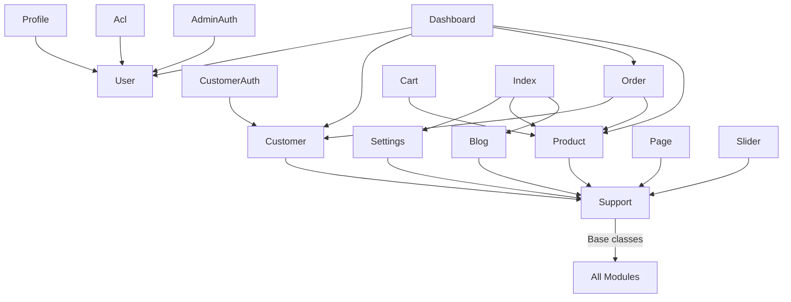

### Module Details

#### Support (Foundation Module)
- **Purpose**: Base classes, traits, validators, helpers shared across all modules
- **Key Components**:
  - `BaseServiceProvider` — route registration pattern
  - `BackendController` / `SiteController` / `AppController` — base controllers
  - `BaseModel` / `SiteModel` — base models (`$guarded = ['_method']`)
  - `Request` / `JsonRequest` — base form requests
  - **Traits**: `ActivityLog`, `Searchable`, `UploadFile`, `EditorImage`, `FileNameGenerator`, `UpdateOrder`
  - **Validators**: `required_editor`, `recaptcha`
  - **Helpers**: `onlyAlphaNumeric()`

#### Acl (Access Control)
- **Purpose**: Role and permission management via Spatie Permission
- **Models**: Uses Spatie's `Permission` and `Role` directly
- **Services**: `GetUserPermissions`, `ListUserPermissions`
- **Boot**: Registers `Gate::before()` — `root` role bypasses all gates

#### AdminAuth
- **Purpose**: Admin authentication (login, logout, password reset)
- **Controllers**: `AuthenticatedSessionController`, `NewPasswordController`, `PasswordResetLinkController`
- **Middleware**: `UserAuth` (guard check)
- **Views**: Blade templates for auth forms

#### Blog
- **Purpose**: Blog content management (posts, categories, tags, authors)
- **Models**: `Post`, `Category`, `Author`, `Tag`
- **Services**: `GetAuthorOptions`, `GetCategoryOptions`, `GetTagOptions`, `SyncPostTags`, `GetArchiveOptions`, `GetPostsFromArchive`, `GetTagOptions` (site)
- **Observer**: `PostObserver` (auto-meta tags)
- **Site Controllers**: `SitePostController`, `SiteArchiveController`, `SiteTagController`, `SitePostSearchController`

#### Cart
- **Purpose**: Shopping cart (backend scaffold, primarily localStorage-based)
- **Model**: `Cart` (minimal — `id` only)
- **Site Routes**: `/cart`, `/checkout`

#### ContactMessage
- **Purpose**: Contact form submissions management
- **Model**: `ContactMessage` (with read tracking, user references)
- **Mail**: `ContactMessageMail`
- **Site Controller**: `SiteContactMessageController` (tracks Meta `Lead` event)

#### Customer
- **Purpose**: Customer management (CRUD, reports, addresses)
- **Models**: `Customer` (extends `Authenticatable`), `CustomerAddress`
- **Observer**: `CustomerObserver` (password hashing)
- **Controller**: `CustomerController` (with recycle bin), `CustomerReportController`

#### CustomerAuth
- **Purpose**: Customer authentication (login, signup, password reset)
- **Controllers**: `AuthenticatedSessionController`, `NewPasswordController`, `PasswordResetLinkController`
- **Middleware**: `CustomerAuth`

#### Dashboard
- **Purpose**: Admin dashboard with KPIs and charts
- **Controller**: `DashboardController@index` — aggregates revenue, orders, products, customers

#### Index
- **Purpose**: Public homepage, static pages, SEO infrastructure (sitemap, robots.txt)
- **Controllers**: `IndexController`, `SitemapController`, `RobotsController`
- **Site Routes**: Homepage, about, privacy, terms, refund, sitemaps, robots

#### Order
- **Purpose**: Order management, reports, public ordering
- **Models**: `Order`, `OrderProduct`
- **Services**: (none — logic in controllers)
- **Job**: `SendOrderPlacedMail` (queued)
- **Site Controller**: `SiteOrderController` (transaction + Meta tracking)

#### Page
- **Purpose**: CMS pages (about, privacy, terms, refund — marked `is_system`)
- **Model**: `Page` (self-referential `parent_id`)

#### Product
- **Purpose**: Product catalog (products, categories, brands, tags, reports)
- **Models**: `Product` (HasMedia), `ProductCategory`, `ProductBrand`, `ProductTag`
- **Services**: `GetProductCategoryOptions`, `GetProductBrandOptions`, `GetProductTagOptions`, `SyncProductTags`, `GetProductsByBrand`, `GetProductsByCategory`
- **Observer**: `ProductObserver` (auto-meta tags)

#### Profile
- **Purpose**: Current user's profile management
- **Controller**: `ProfileController` (show, update, password, email)

#### Settings
- **Purpose**: Application settings (9 groups), SEO service, Meta Conversions API
- **Model**: `Setting` (key-value with groups)
- **Services**: `SettingService` (24h cache), `SeoService` (structured data), `MetaConversionApiService`
- **Helpers**: `setting()`, `settings_group()`

#### Slider
- **Purpose**: Homepage slider management
- **Model**: `Slider` (with ordering)

#### User
- **Purpose**: Admin user management
- **Model**: `User` (HasMedia, HasRoles, morphTo profile)
- **Observer**: `UserObserver` (password hashing, auto profile)

---

## 9. Database Architecture

### Database Configuration

- **Default**: SQLite (`database/database.sqlite`)
- **Production**: MySQL/MariaDB configurable via `.env`
- **Sessions**: Database driver
- **Queue**: Database driver
- **Cache**: Database driver

### Table Overview

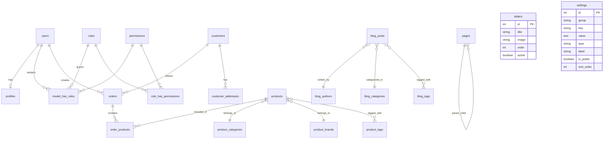

### Complete Table Reference

| Table | Module | Purpose | Soft Deletes | Key Columns |
|---|---|---|---|---|
| `users` | User | Admin users | Yes | `name`, `email` (unique), `password`, `profile_type`, `profile_id` |
| `profiles` | Profile | User profiles | Yes | `user_id`, `bio`, `phone`, `address`, `avatar`, `social_links` |
| `customers` | Customer | Storefront customers | Yes | `name`, `email` (unique), `phone`, `password`, `total_spent`, `active` |
| `customer_addresses` | Customer | Customer addresses | No | `customer_id`, `division_id`, `district_id`, `upazilla_id`, `union_id`, `address`, `default` |
| `orders` | Order | Customer orders | Yes | `customer_id`, `name`, `email`, `phone`, `status` (enum), `subtotal`, `total`, `payment_status`, `payment_method` |
| `order_products` | Order | Order line items | No | `order_id`, `product_id`, `quantity`, `unit_price`, `total_price` |
| `order_shipments` | Order | Shipment tracking | No | `order_id`, `tracking_number`, `carrier`, `shopment_status` |
| `order_history` | Order | Status change log | No | `order_id`, `status`, `notes` |
| `order_payments` | Order | Payment records | No | `order_id`, `payment_method`, `payment_status`, `amount_paid`, `transaction_id` |
| `products` | Product | Product catalog | Yes | `category_id`, `brand_id`, `name`, `slug` (unique), `price`, `sale_price`, `quantity`, `active`, `featured` |
| `product_categories` | Product | Product categories | Yes | `parent_id`, `name`, `slug` (unique), `active`, `featured`, `sort_order` |
| `product_brands` | Product | Product brands | Yes | `parent_id`, `name`, `slug` (unique), `active`, `featured` |
| `product_tags` | Product | Product tags | Yes | `name`, `slug` (unique) |
| `product_product_tag` | Product | Product-tag pivot | No | `product_id`, `product_tag_id` |
| `blog_posts` | Blog | Blog articles | Yes | `blog_author_id`, `blog_category_id`, `title`, `slug` (unique), `content`, `published_at` |
| `blog_categories` | Blog | Blog categories | Yes | `name`, `slug` (unique), `is_visible` |
| `blog_authors` | Blog | Blog authors | Yes | `name`, `email` (unique), `bio` |
| `blog_tags` | Blog | Blog tags | Yes | `name`, `slug` (unique) |
| `blog_posts_tags` | Blog | Post-tag pivot | No | `blog_post_id`, `blog_tag_id` |
| `pages` | Page | CMS pages | Yes | `parent_id`, `title`, `slug` (unique), `content`, `is_system` |
| `sliders` | Slider | Homepage sliders | Yes | `title`, `image`, `order`, `active` |
| `contact_messages` | ContactMessage | Contact submissions | Yes | `name`, `email`, `phone`, `subject`, `message`, `read_at`, `read_by` |
| `settings` | Settings | App configuration | No | `group`, `key` (unique composite), `value`, `type`, `label`, `is_public` |
| `carts` | Cart | Cart scaffold | Yes | `id` only |
| `roles` | Spatie | User roles | No | `name` (unique), `guard_name` |
| `permissions` | Spatie | Permissions | No | `name` (unique), `guard_name` |
| `model_has_roles` | Spatie | User-role pivot | No | `role_id`, `model_type`, `model_id` |
| `model_has_permissions` | Spatie | User-permission pivot | No | `permission_id`, `model_type`, `model_id` |
| `role_has_permissions` | Spatie | Role-permission pivot | No | `role_id`, `permission_id` |
| `activity_log` | Spatie | Audit trail | No | `log_name`, `description`, `subject_type`, `subject_id`, `event`, `properties` |
| `media` | Spatie | Media library | No | `mediable_type`, `mediable_id`, `name`, `file_name`, `mime_type`, `size`, `disk` |
| `cache` | Laravel | Cache store | No | `key`, `value`, `expiration` |
| `jobs` | Laravel | Queue jobs | No | `queue`, `payload`, `attempts`, `reserved_at` |
| `sessions` | Laravel | Session store | No | `user_id`, `ip_address`, `user_agent`, `payload` |

### Performance Indexes

A dedicated migration (`2026_06_23_042220_add_performance_indexes.php`) adds strategic indexes:

| Table | Indexes Added |
|---|---|
| `products` | `active`, `featured`, `[active, featured]` |
| `product_categories` | `active`, `featured`, `sort_order`, `[active, featured, sort_order, name]` |
| `product_brands` | `active` |
| `orders` | `status`, `payment_status`, `[status, payment_status]`, `deleted_at` |
| `order_products` | `[order_id, product_id]` |
| `blog_posts` | `published_at` |
| `blog_authors` | `deleted_at` |
| `blog_tags` | `deleted_at` |
| `sliders` | `active`, `order` |
| `contact_messages` | `read_at`, `deleted_at` |
| `customers` | `active`, `phone`, `deleted_at` |
| `pages` | `active`, `deleted_at` |

---

## 10. Eloquent Models

### Models Map

| Model | Table | Module | Extends | Traits | Key Relationships |
|---|---|---|---|---|---|
| `User` | `users` | User | `Authenticatable` | `HasFactory`, `HasRoles`, `InteractsWithMedia`, `Notifiable`, `Searchable`, `SoftDeletes` | `profile()` (morphTo) |
| `Customer` | `customers` | Customer | `Authenticatable` | `ActivityLog`, `HasFactory`, `Notifiable`, `Searchable`, `SoftDeletes` | `addresses()` hasMany |
| `CustomerAddress` | `customer_addresses` | Customer | `BaseModel` | `ActivityLog`, `HasFactory`, `Searchable`, `SoftDeletes` | `customer()` belongsTo |
| `Product` | `products` | Product | `BaseModel` | `ActivityLog`, `HasFactory`, `InteractsWithMedia`, `Searchable`, `Sluggable`, `SoftDeletes` | `category()` belongsTo, `brand()` belongsTo, `tags()` belongsToMany |
| `ProductCategory` | `product_categories` | Product | `BaseModel` | `ActivityLog`, `HasFactory`, `Searchable`, `Sluggable`, `SoftDeletes` | `products()` hasMany |
| `ProductBrand` | `product_brands` | Product | `BaseModel` | `ActivityLog`, `HasFactory`, `Searchable`, `Sluggable`, `SoftDeletes` | `products()` hasMany |
| `ProductTag` | `product_tags` | Product | `BaseModel` | `ActivityLog`, `HasFactory`, `Searchable`, `Sluggable`, `SoftDeletes` | `products()` belongsToMany |
| `Post` | `blog_posts` | Blog | `BaseModel` | `ActivityLog`, `HasFactory`, `Searchable`, `Sluggable`, `SoftDeletes` | `tags()` belongsToMany, `author()` belongsTo |
| `Category` | `blog_categories` | Blog | `BaseModel` | `ActivityLog`, `HasFactory`, `Searchable`, `Sluggable`, `SoftDeletes` | — |
| `Author` | `blog_authors` | Blog | `BaseModel` | `ActivityLog`, `HasFactory`, `Searchable`, `SoftDeletes` | — |
| `Tag` | `blog_tags` | Blog | `BaseModel` | `ActivityLog`, `HasFactory`, `Searchable`, `Sluggable`, `SoftDeletes` | `posts()` belongsToMany |
| `Order` | `orders` | Order | `BaseModel` | `ActivityLog`, `Searchable`, `SoftDeletes` | `orderProducts()` hasMany |
| `OrderProduct` | `order_products` | Order | `BaseModel` | `ActivityLog`, `Searchable` | `product()` belongsTo |
| `Page` | `pages` | Page | `BaseModel` | `ActivityLog`, `HasFactory`, `Searchable`, `Sluggable`, `SoftDeletes` | `parent()` belongsTo (self) |
| `Slider` | `sliders` | Slider | `BaseModel` | `ActivityLog`, `HasFactory`, `Searchable`, `SoftDeletes` | `createdBy()`, `updatedBy()`, `deletedBy()` |
| `ContactMessage` | `contact_messages` | ContactMessage | `BaseModel` | `ActivityLog`, `Searchable`, `SoftDeletes` | — |
| `Setting` | `settings` | Settings | `Eloquent\Model` | `ActivityLog` | — (key-value) |
| `Cart` | `carts` | Cart | `BaseModel` | `ActivityLog`, `Searchable`, `SoftDeletes` | — |

### Common Patterns

- **Soft Deletes**: Used on most models (except `CustomerAddress`, `OrderProduct`, `Setting`)
- **Activity Logging**: Most models use `ActivityLog` trait (Spatie) for audit trails
- **Searchable**: Most models use `Searchable` trait for multi-column LIKE search
- **Sluggable**: Product-related and content models auto-generate slugs
- **Media Library**: `Product` and `User` use Spatie MediaLibrary (`InteractsWithMedia`)
- **Observer-driven**: Password hashing (`Customer`, `User`), auto-meta tags (`Post`, `Product`)

### Base Model Pattern

```php
// modules/Support/Models/BaseModel.php
class BaseModel extends Model {
    protected $guarded = ['_method'];
}
```

All domain models extend `BaseModel`, which uses `$guarded` instead of `$fillable` — an open guarding approach where only `_method` is protected.

---

## 11. Business Logic Layer

### Service Classes

Services are simple invocable classes that encapsulate specific business operations. They follow a consistent pattern:

| Service | Module | Purpose |
|---|---|---|
| `SettingService` | Settings | CRUD for settings with 24h cache |
| `SeoService` | Settings | Builds SEO meta + JSON-LD structured data |
| `MetaConversionApiService` | Settings | Facebook/Meta Conversions API server-side tracking |
| `GetAuthorOptions` | Blog | Returns author `[{value, label}]` |
| `GetCategoryOptions` | Blog | Returns category options |
| `GetTagOptions` | Blog | Returns tag options |
| `SyncPostTags` | Blog | Syncs post-tag pivot |
| `GetArchiveOptions` | Blog (Site) | Returns unique archive dates |
| `GetPostsFromArchive` | Blog (Site) | Paginated posts for archive date |
| `GetTagOptions` | Blog (Site) | Tags with published posts |
| `GetProductCategoryOptions` | Product | Returns category options (ordered by sort_order) |
| `GetProductBrandOptions` | Product | Returns brand options |
| `GetProductTagOptions` | Product | Returns tag options |
| `SyncProductTags` | Product | Syncs product-tag pivot |
| `GetProductsByBrand` | Product (Site) | Paginated products by brand |
| `GetProductsByCategory` | Product (Site) | Paginated products by category |
| `GetUserPermissions` | Acl | Gets user permissions as `[{id, name}]` |
| `ListUserPermissions` | Acl | Returns flat array of permission names |

### Service Pattern

Services are instantiated via the container (dependency injection in controllers). They are simple classes with a `run()` method:

```php
class GetAuthorOptions {
    public function run(): array {
        return Author::pluck('name', 'id')
            ->map(fn($name, $id) => ['value' => $id, 'label' => $name])
            ->toArray();
    }
}
```

### Shared Traits

| Trait | Module | Purpose |
|---|---|---|
| `ActivityLog` | Support | Wraps Spatie `LogsActivity`, logs dirty attributes only |
| `Searchable` | Support | Multi-column LIKE search with alphanumeric stripping |
| `UploadFile` | Support | File upload to configurable disk |
| `EditorImage` | Support | WYSIWYG image upload → JSON response |
| `FileNameGenerator` | Support | Configurable filename strategies (original, UUID, hash) |
| `UpdateOrder` | Support | Reorder items by updating `order` column |

---

## 12. Controllers

### Controller Architecture

Controllers extend from base classes in the `Support` module:

```
Illuminate\Routing\Controller
    └── AppController (standard Laravel traits)
        └── BackendController (adds auth.user middleware in constructor)
            └── Domain Controllers (e.g., PostController, ProductController)
```

Site controllers extend `SiteController` (plain `Illuminate\Routing\Controller`).

### Controller Analysis

| Controller | Module | Methods | Uses Services | Uses Traits |
|---|---|---|---|---|
| `DashboardController` | Dashboard | `index` | — | — |
| `PostController` | Blog | `index`, `create`, `store`, `edit`, `update`, `destroy`, `uploadEditorImage` | `GetAuthorOptions`, `GetCategoryOptions`, `GetTagOptions`, `SyncPostTags` | `EditorImage`, `UploadFile` |
| `CategoryController` | Blog | `index`, `create`, `store`, `edit`, `update`, `destroy`, `uploadEditorImage` | — | `EditorImage`, `UploadFile` |
| `TagController` | Blog | `index`, `create`, `store`, `edit`, `update`, `destroy` | — | `EditorImage`, `UploadFile` |
| `AuthorController` | Blog | `index`, `create`, `store`, `edit`, `update`, `destroy` | — | `UploadFile` |
| `ProductController` | Product | `index`, `create`, `store`, `edit`, `update`, `destroy`, `destroyGalleryImage`, `recycleBin`, `restore`, `destroyForce`, `emptyRecycleBin`, `restoreRecycleBin` | `GetProductCategoryOptions`, `GetProductBrandOptions`, `GetProductTagOptions`, `SyncProductTags` | `EditorImage`, `UploadFile` |
| `ProductCategoryController` | Product | CRUD + `reorder` + recycle bin | `GetProductCategoryOptions` | `EditorImage`, `UploadFile` |
| `ProductBrandController` | Product | CRUD + recycle bin | — | `EditorImage`, `UploadFile` |
| `ProductTagController` | Product | CRUD + recycle bin | — | — |
| `CustomerController` | Customer | CRUD + recycle bin | — | `Searchable` |
| `OrderController` | Order | CRUD + `updateStatus` + reports | — | `Searchable` |
| `SiteOrderController` | Order | `store`, `confirm` | — | — |
| `SettingsController` | Settings | `redirect`, `show`, `update` | `SettingService` | `UploadFile` |
| `PageController` | Page | CRUD + recycle bin + `uploadEditorImage` | — | `EditorImage`, `UploadFile` |
| `SliderController` | Slider | CRUD + recycle bin | — | `UploadFile` |
| `ProfileController` | Profile | `show`, `update`, `updatePassword`, `updateEmail` | — | — |

### Observations

- Controllers are generally well-structured, following single-responsibility per method.
- The `DashboardController@index` is an exception — it aggregates ~15 different data queries (revenue, orders, products, counts). This could be extracted into a `DashboardService`.
- Most controllers use trait composition (`EditorImage`, `UploadFile`) for file handling rather than service injection.
- Recycle bin pattern is consistently implemented across multiple modules.

---

## 13. Validation

### Validation Strategy

The project uses **Form Request** classes consistently for all write operations.

### Form Request Classes

| Request | Module | Key Rules |
|---|---|---|
| `PermissionValidate` | Acl | `name`: required, string, min:3, max:255, unique |
| `RoleValidate` | Acl | `name`: required, string, min:2, max:255, unique |
| `PostValidate` | Blog | `title`: required, `content`: required, `image`: nullable image 2MB, `published_at`: nullable date |
| `CategoryValidate` | Blog | `name`: required, `image`: image 5MB, `is_visible`: required boolean |
| `AuthorValidate` | Blog | `name`: required, `email`: required unique, `image`: image 2MB |
| `TagValidate` | Blog | `name`: required string max:255 |
| `CartValidate` | Cart | `name`: required |
| `ContactMessageValidate` | ContactMessage | `name`: required, `subject`: required, `message`: required |
| `CustomerValidate` | Customer | `name`: required, `phone`: required digits:11, `email`: required unique, `password`: min:8 |
| `ProductValidate` | Product | `name`: required, `price`: required numeric, `quantity`: required numeric, `image`: image 5MB |
| `ProductCategoryValidate` | Product | `name`: required, `image`: image 2MB |
| `ProductBrandValidate` | Product | `name`: required, `active`/`featured`: required boolean |
| `ProductTagValidate` | Product | `name`: required string max:255 |
| `OrderValidate` | Order | `name`: required (minimal) |
| `SiteOrderValidate` | Order | `name`: required, `phone`: required, `items`: required array |
| `PageValidate` | Page | `title`: required, `content`: required, `image`: nullable image 2MB |
| `SliderValidate` | Slider | `image`: nullable image 5MB, `bg_color`: nullable hex regex |
| `SettingsGroupValidate` | Settings | Dynamic rules based on group parameter |
| `ProfileValidate` | Profile | `name`: required |
| `UpdatePasswordValidate` | Profile | `current_password`: required current_password, `password`: required min:8 confirmed |
| `UpdateEmailValidate` | Profile | `email`: required email unique, `current_password`: required |

### Custom Validators

| Rule | File | Purpose |
|---|---|---|
| `required_editor` | `Support/Validators/required_editor.php` | Validates non-null and not empty `<p></p>` |
| `recaptcha` | `Support/Validators/recaptcha.php` | Server-side Google reCAPTCHA verification |

### Validation Pattern

All requests extend either `Support\Http\Requests\Request` or `Support\Http\Requests\JsonRequest`. The `JsonRequest` variant overrides `failedValidation()` to return a 422 JSON response — useful for AJAX endpoints.

---

## 14. Vue Frontend Architecture (Admin)

### Overview

The admin panel is a full **Inertia.js + Vue 3 SPA** with auto-registered components.

### Application Bootstrap

```javascript
// resources/js/app.js
createInertiaApp({
    resolve: (name) => resolvePageComponent(`./Pages/${name}.vue`),
    setup({ el, App, props, plugin }) {
        return createApp({ render: () => h(App, props) })
            .use(createPinia())
            .use(plugin)
            .use(ZiggyVue, Ziggy)
            .use(Translations)
            .mount(el)
    }
})
```

### Page Directory Structure

```
resources/js/Pages/
├── AclPermission/          # Permission CRUD
├── AclRole/                # Role CRUD
├── AclRolePermission/      # Role-Permission assignment
├── AclUserPermission/      # User-Permission assignment
├── AclUserRole/            # User-Role assignment
├── AdminAuth/              # Login, forgot password, reset password
├── BlogAuthor/             # Author CRUD
├── BlogCategory/           # Category CRUD + Components/
├── BlogPost/               # Post CRUD + Components/
├── BlogTag/                # Tag CRUD
├── ContactMessage/         # Message list + recycle bin
├── Customer/               # Customer CRUD + report + recycle bin
├── CustomerAuth/           # Customer login, signup, reset
├── Dashboard/              # Dashboard with charts
├── Order/                  # Order CRUD + report + show
├── Page/                   # CMS page CRUD + recycle bin
├── Product/                # Product CRUD + report + Components/
├── ProductBrand/           # Brand CRUD + Components/
├── ProductCategory/        # Category CRUD + Components/
├── ProductTag/             # Tag CRUD
├── Profile/                # Profile management + Components/
├── Settings/               # Settings form + Components/ (9 groups)
├── Slider/                 # Slider CRUD + recycle bin
└── User/                   # User CRUD
```

### Component System

Auto-registration via `unplugin-vue-components` with a custom resolver:

```javascript
// resources/js/Resolvers/AppComponentsResolver.js
// Components starting with 'App' are auto-imported from their group folder
const componentGroups = {
    Auth: ['AppAuthLogo', 'AppAuthShell'],
    DataTable: ['AppDataSearch', 'AppDataTable', ...],
    Form: ['AppCheckbox', 'AppInputText', 'AppTipTapEditor', ...],
    Menu: ['AppBreadCrumb', 'AppMenu', 'AppMenuItem', ...],
    Message: ['AppAlert', 'AppFlashMessage', 'AppToast', ...],
    Misc: ['AppButton', 'AppCard', 'AppLink', ...],
    Overlay: ['AppConfirmDialog', 'AppModal', 'AppSideBar']
}
```

### Component Groups

| Group | Components | Purpose |
|---|---|---|
| **DataTable** | `AppDataTable`, `AppDataTableHead`, `AppDataTableRow`, `AppDataTableData`, `AppDataSearch`, `AppPaginator` | Reusable data table with search, sort, pagination |
| **Form** | `AppInputText`, `AppInputPassword`, `AppInputFile`, `AppInputDate`, `AppTextArea`, `AppCheckbox`, `AppRadioButton`, `AppCombobox`, `AppTipTapEditor`, `AppLabel`, `AppFormErrors` | Form element library |
| **Menu** | `AppMenu`, `AppMenuItem`, `AppMenuSection`, `AppBreadCrumb`, `AppBreadCrumbItem` | Navigation components |
| **Message** | `AppFlashMessage`, `AppToast`, `AppTooltip`, `AppAlert` | Notification system |
| **Overlay** | `AppModal`, `AppConfirmDialog`, `AppSideBar` | Overlay/dialog components |
| **Misc** | `AppButton`, `AppCard`, `AppLink`, `AppSectionHeader`, `AppTopBar` | Utility components |
| **Auth** | `AppAuthLogo`, `AppAuthShell`, `AppCustomerAuthLogo` | Authentication UI |

### Layouts

| Layout | File | Usage |
|---|---|---|
| `AuthenticatedLayout` | `resources/js/Layouts/AuthenticatedLayout.vue` | Admin panel (sidebar + topbar + content) |
| `GuestLayout` | `resources/js/Layouts/GuestLayout.vue` | Auth pages (login, forgot password) |

All pages default to `AuthenticatedLayout` unless explicitly set (see `app.js` line 27).

### Composables

| Composable | Purpose |
|---|---|
| `useAuthCan` | Permission checking against shared auth props |
| `useClickOutside` | Click outside detection for dropdowns |
| `useDataSearch` | Search/filter logic for data tables |
| `useFormContext` | Form context provider |
| `useFormErrors` | Form validation error handling |
| `useIsMobile` | Responsive breakpoint detection |
| `useSeo` | SEO meta tag management |
| `useTitle` | Page title management |

### Utilities

| Utility | Purpose |
|---|---|
| `chunk.js` | Array chunking |
| `debounce.js` | Function debouncing |
| `slug.js` | URL slug generation |
| `truncate.js` | String truncation |

### Pinia Stores (Admin)

| Store | Purpose |
|---|---|
| `useSettingsStore` | Settings form state + repeater management |
| `useProductCategoryStore` | Category form state + SEO auto-fill |
| `useCategoryStore` (Blog) | Blog category form state + SEO auto-fill |

### Menu Configuration

The admin sidebar menu (`resources/js/Configs/menu.js`) defines the full navigation structure with permission-based visibility. Each item has a `permission` property that `useAuthCan` checks before rendering.

---

## 15. Frontend Architecture (Public Site)

### Overview

The public site uses a **hybrid architecture**: server-rendered Blade templates with Vue 3 component islands for interactive features.

### Entry Points

| Entry | File | Components |
|---|---|---|
| `index-app.js` | `resources-site/js/index-app.js` | `ShoppingCart`, `NavbarCartMenu`, `AddToCartButton`, `ShopSearch`, `CheckoutForm`, `SliderCarousel`, `BrandsCarousel` |
| `blog-app.js` | `resources-site/js/blog-app.js` | `BlogToolbar`, `NavbarCartMenu` |

### Vue App Factory

```javascript
// resources-site/js/create-vue-app.js
export const createVueApp = (additionalComponents = {}) => {
    const app = createApp({ components: { ...additionalComponents } })
    app.use(createPinia())
    return app
}
```

Each entry point creates a minimal Vue app with only the components needed for that page. This keeps bundle size small.

### Cart Store (Client-Side)

```javascript
// resources-site/js/Stores/CartStore.js
export const useCartStore = defineStore('CartStore', {
    state: () => ({
        items: JSON.parse(localStorage.getItem('cart')) || [],
    }),
    actions: { addItem, removeItem, increaseQuantity, decreaseQuantity, clearCart },
    getters: { totalItems, totalQuantity, subtotal, total }
})
```

The cart is entirely client-side, persisted to `localStorage`. The `carts` database table exists but is minimal (id only) — the cart is not server-side.

### Site Layout

The `site-layout.blade.php` provides:
- Full SEO meta tags (primary, Open Graph, Twitter Cards, JSON-LD)
- Font loading (Nunito from Bunny Fonts CDN)
- Favicon from settings
- Meta Pixel integration with consent management
- Google Analytics support
- Vue `#app` mount point for component islands

### Site Components

| Component | Purpose |
|---|---|
| `SliderCarousel` | Homepage hero slider |
| `BrandsCarousel` | Homepage brand logos |
| `ShopSearch` | Product search with autocomplete |
| `AddToCartButton` | Add to cart with quantity |
| `ShoppingCart` | Cart sidebar/dropdown |
| `NavbarCartMenu` | Cart icon in navbar |
| `CheckoutForm` | Checkout form with geolocation |
| `BlogToolbar` | Blog archive/tag/search filter |

---

## 16. Inertia Architecture

### Shared Props

Defined in `HandleInertiaRequests::share()`:

| Prop | Type | Source |
|---|---|---|
| `auth.user` | Object/null | Current user with avatar_url |
| `auth.permissions` | Array | Flat permission names via `ListUserPermissions` |
| `auth.isRootUser` | Boolean | `hasRole('root')` check |
| `ziggy` | Object | Ziggy route data + current URL |
| `flash.success` | String/null | Session flash success |
| `flash.error` | String/null | Session flash error |
| `datetime.now` | String | Current datetime |
| `branding.site_name` | String | From settings |
| `branding.logo_url` | String/null | From settings |

### Page Resolution

```javascript
resolve: (name) => {
    const page = resolvePageComponent(`./Pages/${name}.vue`, import.meta.glob('./Pages/**/*.vue'))
    page.then((module) => {
        module.default.layout = module.default.layout || Layout
    })
    return page
}
```

Pages are resolved by name from the `Pages/` directory. Default layout is `AuthenticatedLayout`.

### Flash Messages

Flash messages are injected via shared props and displayed by `AppFlashMessage.vue`. The component watches for changes and auto-dismisses after a timeout.

### Form Handling

Forms use Inertia's `useForm()` for:
- Automatic CSRF handling
- Progressive enhancement
- Validation error binding
- Pending state tracking
- Success/error callbacks

### Route Generation

Ziggy provides Laravel named routes to JavaScript:
```javascript
route('dashboard.index')  // → /admin/dashboard
route('product.show', id)  // → /admin/product/{id}/show
```

---

## 17. Tailwind Architecture

### Configuration

- **Tailwind CSS v4** with `@tailwindcss/postcss` plugin
- **Dark mode**: Class-based (`.dark-theme`)
- **Plugins**: `@tailwindcss/forms`, `flowbite/plugin`

### Design Token System

The project implements a comprehensive **CSS custom property** design token system:

```css
:root {
    --color-primary-1 through --color-primary-12   /* Primary palette */
    --color-neutral-1 through --color-neutral-12    /* Neutral palette */
    --color-content / --color-content-1            /* Content colors */
    --color-info / --color-info-light / --color-info-dark
    --color-success / --color-success-light / --color-success-dark
    --color-warning / --color-warning-light / --color-warning-dark
    --color-error / --color-error-light / --color-error-dark
}
```

These tokens are mapped to Tailwind utility classes via the `skin` color namespace:

```javascript
// tailwind.config.cjs
colors: {
    skin: {
        primary: { 1: 'rgb(var(--color-primary-1) / <alpha-value>)', ... },
        neutral: { 1: 'rgb(var(--color-neutral-1) / <alpha-value>)', ... },
        info: { DEFAULT: 'rgb(var(--color-info) / <alpha-value>)', ... },
        success: { ... },
        warning: { ... },
        error: { ... }
    }
}
```

### Typography

- **Font family**: Nunito (loaded from Bunny Fonts CDN)
- Weights: 400, 600, 700

### Dark Mode

Dark mode uses `.dark-theme` class with a complete set of inverted design tokens.

### Content Sources

Tailwind scans:
- `resources/js/**/*.vue` (admin SPA)
- `resources-site/js/**/*.vue` (site Vue components)
- `modules/**/views/**/*.blade.php` (module Blade views)
- `resources-site/views/**/*.blade.php` (site Blade views)
- `vendor/laravel/...` (pagination views)
- `node_modules/flowbite/**/*.js`

### Utility Classes

Custom utility:
```css
@utility input-error {
    @apply ring-skin-error!;
}
```

Global styles:
```css
.active { @apply bg-skin-success-light text-skin-success; }
.inactive { @apply bg-skin-warning-light text-skin-warning; }
```

---

## 18. State Management

### Admin Panel (Inertia + Pinia)

| Mechanism | Usage |
|---|---|
| **Inertia Shared Props** | Auth, permissions, flash, branding — available on every page |
| **Inertia Page Props** | Server-provided data for each page |
| **Pinia Stores** | Form state management (Settings, ProductCategory, BlogCategory) |
| **Vue Composables** | Permission checking, responsive detection, form errors |
| **Local Component State** | `ref()` / `reactive()` for UI state (modals, toggles, etc.) |

### Public Site (Vue Islands + Pinia)

| Mechanism | Usage |
|---|---|
| **Pinia CartStore** | Shopping cart (localStorage-persisted) |
| **Local Component State** | Search, carousel, dropdown state |

### Data Flow

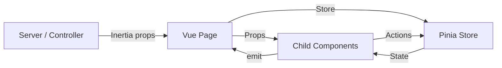

---

## 19. Events & Queues

### Events

| Observer | Model | Hook | Behavior |
|---|---|---|---|
| `PostObserver` | `Post` | `creating` | Auto-fills `meta_tag_title` (60 chars) and `meta_tag_description` (160 chars) from content |
| `ProductObserver` | `Product` | `creating` | Same auto-meta behavior |
| `CustomerObserver` | `Customer` | `saving` | Hashes password if present |
| `UserObserver` | `User` | `saving` | Hashes password if present |
| `UserObserver` | `User` | `created` | Auto-sets `profile_type` and `profile_id` |

### Jobs

| Job | Module | Queue | Purpose |
|---|---|---|---|
| `SendOrderPlacedMail` | App | `default` (database) | Sends order confirmation email to admin |

### Mailables

| Mailable | Module | View | Purpose |
|---|---|---|---|
| `OrderPlacedMail` | App | `order::emails.order-placed` | Admin notification for new orders |
| `ContactMessageMail` | ContactMessage | `contactMessage::contact-message-mail` | Contact form submission notification |

### Notifications

| Notification | Module | Purpose |
|---|---|---|
| `ResetPassword` (Admin) | AdminAuth | Password reset email for admin users |
| `ResetPassword` (Customer) | CustomerAuth | Password reset email for customers |

### Meta Conversions API

The `MetaConversionApiService` sends server-side events to Facebook/Meta:
- `PageView` — On customer login
- `CompleteRegistration` — On customer signup
- `Lead` — On contact form submission
- `Purchase` — On order placement

Features SHA-256 hashing of PII data, consent checks, and test event code support.

---

## 20. Storage

### Filesystem Configuration

| Disk | Driver | Root | Visibility |
|---|---|---|---|
| `local` | Local | `storage/app/private` | Private |
| `public` | Local | `storage/app/public` | Public |
| `s3` | S3 | Configured via env | — |

### File Uploads

Files are uploaded via the `UploadFile` trait, which supports:
- Configurable disk (default: `public`)
- Configurable naming strategy (original, UUID, hash)
- Configurable path

### Media Library

Spatie Media Library is used for:
- **Product gallery**: Multiple images per product (`gallery` collection)
- **User avatars**: Single image per user (`avatar` collection)

### Settings-Based Assets

Logo, favicon, and dark logo are stored in the `public` disk and referenced via the `settings` table with paths like `branding.logo`, `branding.favicon`.

---

## 21. Security Audit

### Strengths

| Area | Implementation |
|---|---|
| **CSRF** | Laravel's `VerifyCsrfToken` middleware on all web routes |
| **XSS Prevention** | Blade `{{ }}` auto-escaping; Vue template auto-escaping |
| **Authentication** | Rate-limited login (5 attempts), separate guards for admin/customer |
| **Authorization** | Spatie Permission with granular per-route `can:` gates |
| **Password Hashing** | bcrypt with 12 rounds (configurable) |
| **Session Security** | Database sessions, SameSite=Lax, HTTP-only cookies |
| **SQL Injection** | Eloquent parameterized queries throughout |
| **Validation** | Form Request classes on all write operations |
| **File Upload Validation** | MIME type + size validation on all upload endpoints |
| **Admin Panel Exclusion** | `<meta name="robots" content="noindex, nofollow">` on admin |
| **reCAPTCHA** | Server-side verification available for forms |

### Weaknesses

| Area | Issue | Severity |
|---|---|---|
| **Rate Limiting** | Only login has rate limiting; no throttling on other endpoints (contact form, order, search) | Medium |
| **Mass Assignment** | `BaseModel` uses `$guarded = ['_method']` — effectively open for mass assignment | High |
| **Input Sanitization** | Blog post content stored as raw HTML from TipTap editor | Medium |
| **CSRF on API** | `routes/api.php` uses `auth:sanctum` but no CSRF (API design choice) | Low |
| **Session Encryption** | `SESSION_ENCRYPT=false` in default config | Low |
| **Environment Config** | `.env` is accessible in the project root (not excluded from web server) | Low |
| **API Route Exposure** | Geo-lookup routes in `web.php` have no authentication | Low |

---

## 22. Performance Audit

### Strengths

- **Performance indexes migration**: Dedicated migration adds strategic indexes on frequently queried columns
- **Settings cache**: `SettingService` caches settings for 24 hours
- **Queued email**: Order notification emails are dispatched to the queue
- **Vite code splitting**: Multiple entry points (admin, site index, site blog) for optimal loading
- **Sitemap caching**: 1-hour cache on sitemap generation
- **Lazy loading**: Inertia's deferred props could be leveraged (currently configured but not heavily used)

### Weaknesses & Recommendations

| Issue | Location | Recommendation |
|---|---|---|
| **N+1 queries likely** | `DashboardController@index` — multiple independent queries without eager loading constraints | Add `with()` eager loading; consider caching dashboard data |
| **No pagination on some lists** | Various index methods | Ensure all list endpoints use pagination |
| **Cart is localStorage only** | `CartStore.js` | No server-side cart persistence; cart lost on browser clear |
| **Sitemap regeneration** | `SitemapController` — cached for 1 hour | Acceptable for current scale |
| **No Redis** | Cache/session/queue all use database | Redis would significantly improve performance at scale |
| **Large settings queries** | `setting()` helper called on every page | Mitigated by 24h cache, but cache invalidation could be more granular |
| **Image optimization** | No automatic image compression/optimization on upload | Consider queue-based image processing pipeline |

---

## 23. Code Quality Audit

### SOLID Compliance

| Principle | Assessment |
|---|---|
| **Single Responsibility** | Generally good. Controllers handle one entity. Services handle one operation. Exception: `DashboardController@index`. |
| **Open/Closed** | Good. Traits provide extension points without modifying base classes. |
| **Liskov Substitution** | Acceptable. `Customer` extends `Authenticatable` directly rather than `BaseModel`. |
| **Interface Segregation** | Minimal interfaces. Services are concrete classes, not interface-backed. |
| **Dependency Inversion** | Controllers inject service classes. No repository interfaces for testing abstraction. |

### DRY Violations

| Issue | Location | Details |
|---|---|---|
| **Recycle bin pattern** | Multiple controllers | The `recycleBin()`, `restore()`, `destroyForce()`, `emptyRecycleBin()`, `restoreRecycleBin()` methods are repeated across `PageController`, `SliderController`, `ContactMessageController`, `CustomerController` |
| **Pinia stores** | `ProductCategoryStore`, `BlogCategory/CategoryStore` | Near-identical SEO auto-fill and slug generation logic |
| **Service option classes** | `GetAuthorOptions`, `GetCategoryOptions`, `GetProductCategoryOptions` | Same pattern repeated with different models |
| **Upload trait usage** | Every controller with file uploads | Same `UploadFile` configuration pattern |

### KISS Assessment

- **Good**: Services are simple invocable classes with a `run()` method
- **Good**: No over-engineering with repositories or complex abstractions
- **Concern**: `DashboardController@index` is a 100+ line method aggregating all dashboard data

### Technical Debt

| Item | Impact | Priority |
|---|---|---|
| `App\Models\Product` is an unused stub | Confusing; should be deleted | Low |
| `App\Models\User` is the default scaffold | Unused by auth; confusing alongside `Modules\User\Models\User` | Low |
| No interface-based service contracts | Makes testing harder, reduces flexibility | Medium |
| `$guarded = ['_method']` on BaseModel | Security risk — mass assignment open | High |

---

## 24. Dependency Analysis

### Module Dependencies

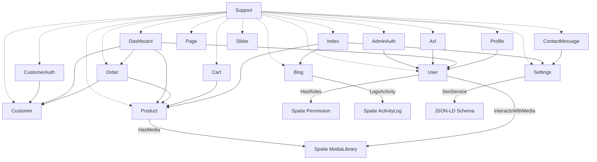

### External Package Dependencies

| Package | Used By | Purpose |
|---|---|---|
| `spatie/laravel-medialibrary` | Product, User | File/media management |
| `spatie/laravel-permission` | Acl, User | Roles & permissions |
| `spatie/laravel-activitylog` | Support (ActivityLog trait) | Audit logging |
| `daniel-cintra/modular` | Support (BaseServiceProvider) | Module route loading |
| `tightenco/ziggy` | app.js, HandleInertiaRequests | Laravel routes in JS |
| `inertiajs/inertia-laravel` | All controllers | SPA page rendering |
| `devfaysal/bangladesh-geocode` | web.php | Geo division data |

### Potential Issues

- **Unused `daniel-cintra/modular-blog`** package is in `composer.json` but the blog module is custom-built
- **`App\Models\Product`** and **`App\Models\User`** in `app/Models/` are unused stubs that could confuse developers

---

## 25. Configuration Analysis

| Config | Purpose | Key Settings |
|---|---|---|
| `app.php` | Application basics | Name from env, UTC timezone, AES-256-CBC encryption |
| `auth.php` | Dual guard auth | `user` guard → Module User, `customer` guard → Module Customer |
| `database.php` | DB connections | SQLite default, MySQL/MariaDB/PostgreSQL/SQLServer available |
| `queue.php` | Job queues | Database driver, 90s retry_after |
| `session.php` | Session management | Database driver, 120min lifetime, SameSite=Lax |
| `cache.php` | Caching | Database store |
| `filesystems.php` | File storage | Local (private), public, S3 |
| `mail.php` | Email transport | Dynamic SMTP config from settings table |
| `inertia.php` | Inertia config | SSR enabled, pages from `resources/js/Pages` |
| `modular.php` | Module config | Login URL: `/admin`, default routes |
| `permission.php` | Spatie Permission | Standard tables, 24h cache, no teams, no wildcards |
| `activitylog.php` | Spatie ActivityLog | Activity logging configuration |

### Dynamic Configuration

The `AppServiceProvider` dynamically applies SMTP settings from the database at boot time:
```php
config([
    'mail.mailers.smtp.host' => $mail['host'],
    'mail.mailers.smtp.port' => $mail['port'],
    // ...
])
```

This allows admin users to configure mail settings through the UI without touching `.env`.

---

## 26. Testing Architecture

### Test Framework

- **Pest v4** with `RefreshDatabase` trait on all Feature tests
- Base test class: `Tests\TestCase`

### Test Coverage

| Module | Test Files | Type |
|---|---|---|
| AdminAuth | `AuthenticationTest`, `PasswordResetTest` | Feature |
| CustomerAuth | `AuthenticationTest`, `PasswordResetTest` | Feature |
| Acl | `PermissionTest`, `UserPermissionTest`, `GetUserPermissionTest`, `RoleTest`, `RolePermissionTest`, `UserRoleTest` | Feature |
| Blog | `PostTest`, `CategoryTest`, `TagTest`, `AuthorTest`, `PostTest` (Site), Services (4 tests), Site Services (3 tests) | Feature |
| Cart | `CartTest` | Feature |
| ContactMessage | `ContactMessageTest`, `SiteContactMessageTest` | Feature |
| Customer | `CustomerTest`, `CustomerReportTest` | Feature |
| Dashboard | `DashboardTest` | Feature |
| Index | `IndexTest` | Feature |
| Order | `OrderTest`, `OrderReportTest`, `SiteOrderTest`, `SendOrderPlacedMailTest` | Feature |
| Page | `PageTest` | Feature |
| Product | `ProductTest`, `ProductCategoryTest`, `ProductBrandTest`, `ProductTagTest`, `SiteProductTest`, `ProductReportTest` | Feature |
| Profile | `ProfileTest` | Feature |
| Settings | `SettingsTest` | Feature |
| Slider | `SliderTest` | Feature |
| Support | `UploadFileTraitTest`, `EditorImageTraitTest`, `FileNameGeneratorTraitTest`, `ActivityLogTraitTest`, `SearchableTraitTest`, `UpdateOrderTraitTest` | Feature/Unit |
| User | `UserTest` | Feature |

### Testing Patterns

- Tests use `RefreshDatabase` trait (database resets between tests)
- Factories are used for model creation (`CustomerFactory`, `BlogPostFactory`, etc.)
- Tests are organized co-located within modules (`modules/*/Tests/`)
- **Total**: ~50 test files across all modules

### Gaps

| Gap | Impact |
|---|---|
| No unit tests in `tests/Unit/` | Only example test |
| No browser/E2E tests | No Playwright/Cypress |
| No API tests | `routes/api.php` is not tested |
| Limited edge case coverage | Tests focus on happy paths |

---

## 27. Deployment Architecture

### Environment Requirements

- PHP 8.4 with required extensions
- Node.js (for Vite build)
- SQLite or MySQL
- Web server (Apache/Nginx)
- Queue worker (`php artisan queue:listen`)
- Cron job (`php artisan schedule:run`)

### Deployment Script

```bash
#!/usr/bin/env bash
# deploy.sh
git pull --rebase
composer install --no-dev --optimize-autoloader
npm ci && npm run build
php artisan optimize        # Cache config, routes, views
php artisan migrate --force
```

### Production Commands

| Command | Purpose |
|---|---|
| `php artisan optimize` | Cache config, routes, views, events |
| `php artisan migrate --force` | Run pending migrations |
| `php artisan queue:work` | Process queued jobs |
| `php artisan schedule:run` | Execute scheduled tasks (cron) |
| `php artisan storage:link` | Create public storage symlink |

### Recommendations

- Use Redis for cache/session/queue in production
- Set up proper cron for queue worker supervision (Supervisor)
- Consider Laravel Forge or Vapor for managed deployment
- Add health check endpoint (already configured: `/up`)
- Environment-specific `.env` with `APP_DEBUG=false`

---

## 28. Coding Standards

### PHP Standards

- **PSR-12**: Followed via Laravel Pint (`vendor/bin/pint`)
- **PHP 8.4 features**: Constructor property promotion, readonly properties, enums
- **Laravel conventions**: Eloquent naming, route naming (`entity.action`), request classes

### Vue Standards

- **Composition API**: All components use `<script setup>`
- **PascalCase** for component files and directories
- **App prefix** for shared components (e.g., `AppDataTable`, `AppButton`)
- **ESLint + Prettier**: Configured with Vue and Tailwind plugins

### Naming Conventions

| Element | Convention | Example |
|---|---|---|
| Models | PascalCase, singular | `Product`, `BlogPost` |
| Controllers | PascalCase, suffixed | `ProductController`, `SiteProductController` |
| Services | PascalCase, descriptive | `GetProductCategoryOptions` |
| Requests | PascalCase, suffixed | `ProductValidate`, `SiteOrderValidate` |
| Routes | kebab-case URIs | `product-category`, `blog-post` |
| Route names | dot notation | `product.index`, `productCategory.store` |
| Vue pages | PascalCase | `ProductForm.vue`, `OrderIndex.vue` |
| Vue components | PascalCase with App prefix | `AppDataTable.vue` |
| Pinia stores | camelCase | `useSettingsStore` |
| CSS | Tailwind utilities | `bg-skin-primary-9 text-white` |

---

## 29. Strengths

1. **Clean modular architecture** — Each domain is self-contained with its own models, controllers, services, routes, migrations, and tests. This is a well-executed modular pattern.

2. **Dual frontend strategy** — Inertia SPA for admin (rich interactivity) and Blade + Vue islands for public site (SEO + performance) is an excellent architectural choice.

3. **Comprehensive ACL** — Spatie Permission integration with ~100 granular permissions, root role bypass, and permission-gated routes demonstrates mature access control.

4. **Design token system** — The CSS custom property system with semantic color tokens (`skin-primary-9`, `skin-success`, etc.) provides excellent theming flexibility and dark mode support.

5. **Reusable component library** — Auto-registered Vue components (`AppDataTable`, `AppButton`, `AppModal`, etc.) with consistent API reduce duplication across 90+ Vue pages.

6. **Consistent patterns** — Recycle bin, file upload, editor image, activity logging, and searchable traits are consistently applied across all modules.

7. **Strong SEO infrastructure** — `SeoService` with JSON-LD structured data, Open Graph, Twitter Cards, XML sitemaps, and robots.txt generation.

8. **Meta Conversions API** — Server-side event tracking with PII hashing and consent management shows attention to privacy and analytics.

9. **Test coverage** — ~50 test files across all modules, co-located with their code, using Pest with RefreshDatabase.

10. **Dynamic configuration** — Settings stored in the database with caching, allowing admin users to configure mail, SEO, branding, and pixel settings without code changes.

---

## 30. Weaknesses

### Critical

| # | Issue | Details |
|---|---|---|
| 1 | **Mass assignment vulnerability** | `BaseModel` uses `$guarded = ['_method']` which leaves all other attributes mass-assignable. Any controller that passes user input directly to `create()` or `update()` without explicit field filtering is vulnerable. |
| 2 | **No rate limiting on public endpoints** | Contact form, order placement, search, and authentication endpoints lack throttling beyond login. |

### High

| # | Issue | Details |
|---|---|---|
| 3 | **Unused model stubs** | `App\Models\Product` and `App\Models\User` are scaffold defaults that conflict with module models and confuse developers. |
| 4 | **Cart is client-side only** | Shopping cart stored in `localStorage` only — no server-side persistence, no recovery for logged-in customers, lost on browser clear. |
| 5 | **Recycle bin code duplication** | 5+ identical methods repeated across 4+ controllers without trait extraction. |
| 6 | **No repository pattern** | Services inject Eloquent models directly, making controller testing harder and coupling to database implementation. |
| 7 | **`DashboardController` is fat** | 100+ line method with 15+ database queries — should be a dedicated service. |

### Medium

| # | Issue | Details |
|---|---|---|
| 8 | **No API versioning** | `routes/api.php` exists but has no versioned endpoints. |
| 9 | **No dedicated Product model in modules** | Product model uses Spatie MediaLibrary but no proper API resources for JSON responses. |
| 10 | **Duplicate Pinia stores** | `ProductCategoryStore` and `BlogCategory/CategoryStore` share near-identical logic. |
| 11 | **Inconsistent model inheritance** | `Customer` extends `Authenticatable` directly while other models extend `BaseModel`. |
| 12 | **No soft delete on `order_products`** | Line items cannot be recovered if accidentally deleted. |
| 13 | **`order_payments` table defined but unused** | Migration exists but no corresponding model or code reference. |

### Low

| # | Issue | Details |
|---|---|---|
| 14 | **`order_shipments` table defined but unused** | Migration exists but no model, controller, or service. |
| 15 | **No `app/Console/Kernel.php`** | Uses Laravel 11+ pattern, but no custom scheduled tasks are defined. |
| 16 | **No API documentation** | No OpenAPI/Swagger spec for any endpoints. |
| 17 | **Mixed coding styles** | Some modules use `$fillable`, others use `$guarded`. |
| 18 | **Blade views in `resources-site/views/components/`** | Minimal — only 4 components (header, footer, breadcrumb, product-card). |

---

## 31. Improvement Roadmap

### Immediate (1-2 weeks)

1. **Fix mass assignment**: Change `BaseModel` to use `$fillable` or add proper `$guarded` arrays to all models. Audit every `create()` and `update()` call.
2. **Delete unused stubs**: Remove `app/Models/Product.php` and `app/Models/User.php`.
3. **Add rate limiting**: Apply `throttle:60,1` middleware to contact form, order placement, and search endpoints.
4. **Extract recycle bin trait**: Create `RecycleBin` trait in Support module with the 5 repeated methods.

### Short Term (1-3 months)

5. **Extract `DashboardService`**: Move all dashboard data aggregation from `DashboardController` into a service class.
6. **Add repository interfaces**: For the most critical models (Product, Order, Customer), add interface-based abstractions for testability.
7. **Implement server-side cart**: For logged-in customers, persist cart to the database.
8. **Consolidate Pinia stores**: Create a shared `useSeoFormStore` composable to eliminate duplicated SEO logic.
9. **Add API resources**: Create Eloquent API Resources for all models to standardize JSON responses.
10. **Add `order_payments` and `order_shipments` models**: Complete the order domain with proper models and services.

### Long Term (3-6 months)

11. **Implement Redis**: Move cache, session, and queue to Redis for production performance.
12. **Add API versioning**: Version all API endpoints under `/api/v1/`.
13. **Add OpenAPI documentation**: Generate Swagger docs for all API endpoints.
14. **Add E2E tests**: Implement Playwright tests for critical user flows (login, checkout, order placement).
15. **Image optimization pipeline**: Add queue-based image processing (resize, compress, WebP conversion) via Spatie MediaLibrary's `usingConversions`.
16. **Implement CQRS**: For the order domain, consider separating read and write models as the order volume grows.

### Future Scalability

17. **Multi-tenancy**: The `Permission` config has a `teams` option (currently disabled). Enabling it would allow multi-store support.
18. **Event sourcing**: For order state management, consider event sourcing to maintain a complete audit trail.
19. **Microservice extraction**: The Order, Product, and Customer modules are well-bounded and could be extracted as services if scale demands it.
20. **Laravel Horizon**: Replace basic queue worker with Horizon for queue monitoring and management.

---

## 32. Architecture Scorecard

| Category | Score | Reasoning |
|---|---|---|
| **Architecture** | 7/10 | Strong modular pattern with clear domain boundaries. Deducted for mass assignment vulnerability, unused stubs, and some fat controllers. |
| **Maintainability** | 7/10 | Good separation of concerns, consistent patterns, co-located tests. Deducted for code duplication (recycle bin, Pinia stores) and lack of interfaces. |
| **Scalability** | 6/10 | Modular structure scales well, but database-backed queue/cache/session will bottleneck. Cart is localStorage-only. |
| **Security** | 6/10 | Good foundations (CSRF, validation, ACL) but mass assignment vulnerability and missing rate limiting are significant concerns. |
| **Performance** | 7/10 | Good index strategy, settings caching, queued emails, Vite code splitting. Deducted for no Redis, potential N+1 issues, and database-backed everything. |
| **Code Quality** | 7/10 | Consistent naming, PSR-12 via Pint, Composition API throughout. Deducted for duplication, fat controller, and inconsistent model inheritance. |
| **Testing** | 6/10 | ~50 test files is respectable for the module count. Deducted for no unit tests, no E2E tests, and no API tests. |
| **Documentation** | 5/10 | No API docs, no architecture docs (until this report), no inline documentation strategy. Code is self-documenting through naming. |
| **Frontend** | 8/10 | Excellent component library, auto-registration, design tokens, dual-frontend strategy. Dedicated Inertia SPA + Vue islands approach is well-executed. |
| **Backend** | 7/10 | Solid Laravel 13 patterns, service layer, trait composition, observer pattern. Needs better abstraction boundaries. |
| **Developer Experience** | 8/10 | `composer dev` script runs everything concurrently. Pest testing. Vite HMR. Ziggy routes. Auto component registration. Well-organized module structure. |
| **Overall Project** | **7/10** | A well-structured e-commerce platform with strong architectural foundations. The modular approach, dual frontend strategy, and comprehensive ACL demonstrate maturity. Key improvements needed in security (mass assignment), performance (Redis), and code deduplication. |

---

> **Report generated by MiMoCode Staff Software Architect**  
> **Last updated: 2026-07-17**
